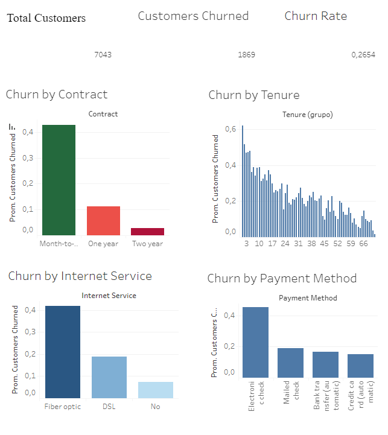

# 📉 Análisis de Abandono de Clientes (Customer Churn Analysis)

## 📌 Descripción del Proyecto

Este proyecto analiza el comportamiento de abandono de clientes en una empresa de telecomunicaciones utilizando SQL y Tableau.

El objetivo es identificar patrones relacionados con la pérdida de clientes y comprender qué factores influyen más en el churn.

El análisis se enfoca en contratos, antigüedad de clientes, servicios de internet y métodos de pago para generar insights de negocio que ayuden a mejorar la retención de clientes.

---

## 🛠 Herramientas Utilizadas

* SQL (MySQL)
* Tableau
* Excel
* GitHub

---

## 📂 Dataset

Dataset utilizado: Telco Customer Churn Dataset

El dataset contiene información sobre:

* Datos demográficos de clientes
* Servicios contratados
* Tipos de contrato
* Pagos mensuales y totales
* Métodos de pago
* Estado de abandono del cliente (Churn)

---

## 📊 Dashboard

### 🔗 Dashboard Interactivo

[Ver Dashboard en Tableau Public]([PEGAR_LINK_TABLEAU](https://public.tableau.com/app/profile/alan.carrizo8741/viz/dashboard_churn_analysis/ChurnAnalysis?publish=yes))

---

## 📷 Vista Previa del Dashboard



---

## 🔍 Preguntas de Negocio

Este análisis busca responder las siguientes preguntas:

* ¿Cuál es el porcentaje total de abandono de clientes?
* ¿Qué tipos de contrato tienen mayor churn?
* ¿Los clientes nuevos abandonan más?
* ¿Qué servicio de internet presenta mayor abandono?
* ¿Cómo influyen los métodos de pago en la retención?

---

## 📈 Insights Principales

* Los clientes con contratos mensuales presentan el mayor churn rate.
* Los clientes dentro de sus primeros 12 meses tienen mayor probabilidad de abandonar la empresa.
* Los clientes con fibra óptica muestran mayor churn que los clientes DSL.
* Los métodos de pago automáticos presentan mayor retención.
* Los usuarios de cheque electrónico tienen el mayor porcentaje de abandono.

---

## 🧠 Habilidades Demostradas

* Limpieza de datos
* Análisis de datos con SQL
* Segmentación de clientes
* Business Intelligence
* Visualización de datos
* Análisis de KPIs
* Diseño de dashboards en Tableau
* Storytelling con datos

---

## 📁 Estructura del Proyecto

```text
customer-churn-analysis/
│
├── data/
├── sql/
├── images/
├── README.md
└── dashboard/
```

---

## 🚀 Posibles Mejoras Futuras

* Modelos predictivos de churn
* Segmentación avanzada de clientes
* Análisis con Python
* KPIs más avanzados
* Dashboards interactivos con filtros dinámicos

---

## 👤 Autor

Alan Carrizo

* GitHub: https://github.com/AalaNC
* LinkedIn: https://www.linkedin.com/in/alan-carrizo-985865195/
